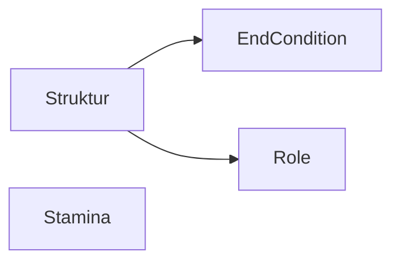

```mermaid
graph LR;
Struktur --> EndCondition;
Struktur --> Role;
Stamina;

click Struktur "./CoreMechanic#^struktur-permainan" "Cek struktur permainan"
click EndCondition "./CoreMechanic#^end-condition" "Cek end condition"
click Role "./CoreMechanic#^role" "Cek struktur permainan"
click Stamina "./CoreMechanic#^stamina" "Cek struktur permainan"
```
