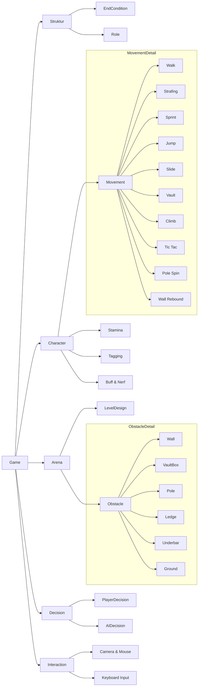

```mermaid
graph LR;
Game --> Struktur;
Game --> Character;
Game --> Arena;
Game --> Decision;
Game --> Interaction;


Struktur --> EndCondition;
Struktur --> Role;
Character --> Movement;
Character --> Stamina;
Character --> Tagging;
Character --> BuffNerf["Buff & Nerf"];
Arena --> LevelDesign;
Arena --> Obstacle;
Decision --> PlayerDecision;
Decision --> AIDecision;
Interaction --> CameraMouse["Camera & Mouse"];
Interaction --> KeyboardInput["Keyboard Input"];

subgraph MovementDetail;
direction TB;
Movement --> Walk;
Movement --> Strafing;
Movement --> Sprint;
Movement --> Jump;
Movement --> Slide;
Movement --> Vault;
Movement --> Climb;
Movement --> TicTac["Tic Tac"];
Movement --> PoleSpin["Pole Spin"];
Movement --> WallRebound["Wall Rebound"];
end;

subgraph ObstacleDetail;
direction TB;
Obstacle --> Wall;
Obstacle --> VaultBox;
Obstacle --> Pole;
Obstacle --> Ledge;
Obstacle --> Underbar;
Obstacle --> Ground;

end;

click Game "./coreexperience" "Cek core experience"
click Struktur "./coremechanic#struktur-permainan" "Cek struktur permainan"
click Character "./coremechanic#character" "Cek character"
click Arena "./coremechanic#arena" "Cek core experience"
click Decision "./coremechanic#decision" "Cek core experience"
click Interaction "./coremechanic#interaction" "Cek core experience"

click Movement "./coremechanic#movement" "Cek movement"
click Walk "./coremechanic#walk" "Cek movement"
click Strafing "./coremechanic#strafing" "Cek movement"
click Sprint "./coremechanic#sprint" "Cek movement"
click Jump "./coremechanic#jump" "Cek movement"
click Slide "./coremechanic#slide" "Cek movement"
click Vault "./coremechanic#vault" "Cek movement"
click Climb "./coremechanic#climb" "Cek movement"
click TicTac "./coremechanic#tic-tac" "Cek movement"
click PoleSpin "./coremechanic#pole-spin" "Cek movement"
click WallRebound "./coremechanic#wall-rebound" "Cek movement"

click Stamina "./coremechanic#stamina" "Cek stamina"
click Tagging "./coremechanic#tagging" "Cek stamina"
click BuffNerf "./coremechanic#buff-nerf" "Cek stamina"

click LevelDesign "./coremechanic#level-design" "Cek stamina"
click Obstacle "./coremechanic#obstacle" "Cek stamina"
click Wall "./coremechanic#wall" "Cek stamina"
click VaultBox "./coremechanic#vault-box" "Cek stamina"
click Pole "./coremechanic#pole" "Cek stamina"
click Ledge "./coremechanic#ledge" "Cek stamina"
click Underbar "./coremechanic#underbar" "Cek stamina"
click Ground "./coremechanic#ground" "Cek stamina"

click CameraMouse "./coremechanic#camera-n-mouse" "Cek stamina"
click KeyboardInput "./coremechanic#keyboard-input" "Cek stamina"

click EndCondition "./coremechanic#end-condition" "Cek end condition"
click Role "./coremechanic#role" "Cek role"


```
