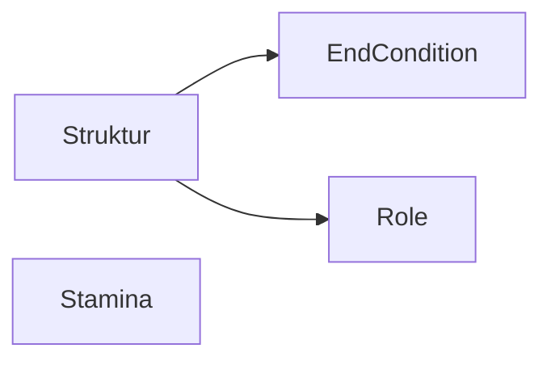

```mermaid
graph LR;
Struktur --> EndCondition;
Struktur --> Role;
Stamina;

click Struktur "./coremechanic#struktur-permainan" "Cek struktur permainan"
click EndCondition "./coremechanic#end-condition" "Cek end condition"
click Role "./coremechanic#role" "Cek struktur permainan"
click Stamina "./coremechanic#stamina" "Cek struktur permainan"
```
